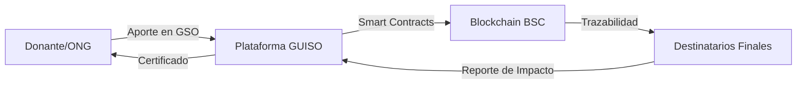

# GUISO: Tecnología con Propósito Humano 🍲


## 🌟 Nuestra Misión
GUISO es una plataforma diseñada para demostrar que la tecnología **blockchain** puede ser una herramienta poderosa para la cooperación humana. Nuestra misión es construir un puente transparente y directo entre quienes desean ayudar y las comunidades que necesitan apoyo, eliminando intermediarios innecesarios y devolviendo la confianza a la acción social.

**En GUISO, cada gramo de ayuda llega a su destino de forma verificable.**

---

## 💡 ¿Por qué GUISO?

### El Problema
La ayuda social tradicional a menudo carece de transparencia. Los colaboradores se preguntan: *¿A dónde va mi aporte? ¿Realmente generó un cambio?* Esta incertidumbre crea una barrera que impide que la ayuda fluya hacia donde más se necesita.

### Nuestra Solución
Utilizamos la tecnología para hacer que el impacto sea tangible:
- **Transparencia Radical:** Cada acción genera un registro inmutable en la red.
- **Impacto Verificable:** Traducimos transacciones digitales en resultados humanos reales (comidas, kits, apoyo).
- **Comunidad Activa:** Un ecosistema donde usuarios y comercios colaboran directamente.

---

## 🔄 El Ciclo de Impacto GUISO
Entiende cómo funciona nuestro ecosistema en 10 segundos:


### 🏗️ Estructura del Ecosistema (Flujo de Transparencia)
El siguiente diagrama detalla la arquitectura de confianza que permite que cada donación en **GSO** se transforme en impacto real verificable a través de la **Binance Smart Chain (BSC)**:




---

## 🚀 El MVP Actual
Nuestra versión actual permite experimentar el flujo completo del ecosistema de impacto:
1. **Conexión de Billetera:** Identidad digital segura.
2. **Exploración de Causas:** Proyectos sociales reales esperando apoyo.
3. **Aporte de GSO:** Uso del token **BEP-20** (simulado en Testnet) para activar la ayuda.
4. **Generación de Impacto:** Obtención de **Puntos de Impacto (IP)** y certificados digitales.
5. **Historial Transparente:** Seguimiento de cada acción realizada.

---

## 🛠️ Para Desarrolladores y Colaboradores

Si crees que la tecnología debe servir para mejorar la vida de los demás, este es tu lugar.

### Stack Tecnológico
- **Frontend:** React + Tailwind CSS + Motion.
- **Blockchain:** Binance Smart Chain (BSC).
- **Lógica:** Motor de impacto personalizado para gamificación social.

### Inicio Rápido
```bash
# Instalar dependencias
npm install

# Iniciar entorno de desarrollo
npm run dev
```

---

## 📂 Estructura del Proyecto
- [Visión del Proyecto](./VISION.md) - El "por qué" detrás de GUISO.
- [Documentación Técnica](./docs/architecture.md) - Cómo está construido el sistema.
- [Modelo de Impacto](./docs/impact-model.md) - La lógica detrás de los puntos y niveles.
- [Ecosistema](./docs/ecosystem.md) - El rol de usuarios, comercios y el token GSO.
- [Guía de Contribución](./CONTRIBUTING.md) - Cómo sumarte al equipo.

---

## 🤝 Unirse al Propósito
Buscamos personas apasionadas por la tecnología y el impacto social. No importa si eres dev, diseñador o simplemente alguien que quiere ayudar; la transparencia y la empatía son los únicos requisitos.

---

## 👨‍💻 Desarrollado por
Este proyecto fue concebido y desarrollado por **Gustavo Pere**, con la visión de que la tecnología debe ser una herramienta para la empatía y la acción social real.

---

## 📄 Licencia
Este proyecto es de código abierto bajo la licencia **Apache-2.0**. Creemos que la transparencia debe empezar desde el código mismo.
