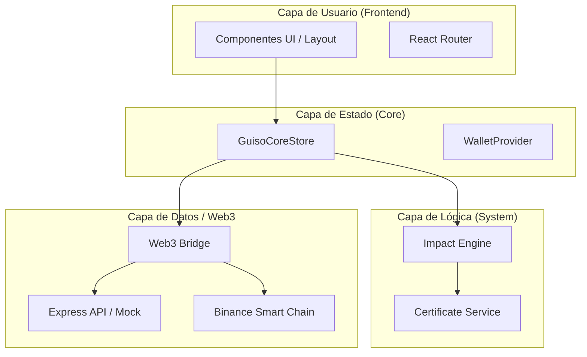

# Arquitectura Técnica: Aplicación GUISO Token

## 🏗️ Visión General
La plataforma GUISO está construida como una **Aplicación de Página Única (SPA)** moderna, diseñada para ser modular y escalable. Aunque actualmente utiliza un backend simulado para el MVP, su arquitectura está preparada para integrarse con contratos inteligentes reales en la Binance Smart Chain (BSC).



## 🎨 Estructura del Proyecto
Utilizamos una arquitectura basada en **características (features)**, lo que permite que cada módulo de negocio (Impacto, Perfil, Comercio) sea independiente y fácil de mantener.

```text
src/
├── components/     # Componentes de UI compartidos (Layout, Botones, Modales)
├── core/           # El "cerebro" de la app (GuisoCoreStore)
├── features/       # Módulos de lógica de negocio
│   ├── dashboard/  # Analíticas y estadísticas globales
│   ├── impact/     # Proyectos sociales y lógica de apoyo
│   └── profile/    # Datos del usuario e historial personal
├── system/         # Motores internos (Motor de Impacto)
├── web3/           # Capa de comunicación con la Blockchain
└── types/          # Definiciones de TypeScript para todo el sistema
```

## 🧠 Gestión de Estado (Motor SocialFi)
El estado de la aplicación se gestiona de forma centralizada para garantizar que la "verdad" del impacto sea consistente en toda la interfaz.

### Flujo de Datos:
1. **Acción del Usuario:** El usuario decide apoyar un proyecto.
2. **Validación:** El sistema verifica que el usuario tenga los tokens GSO necesarios.
3. **Procesamiento:** El `impactEngine` calcula los puntos de impacto y actualiza el nivel.
4. **Persistencia:** La acción se registra y se guarda localmente (y próximamente on-chain).

## 📡 Backend y Escalabilidad
Actualmente, un servidor **Express.js** sirve la aplicación y proporciona una API simulada.

### Hoja de Ruta Técnica:
1. **Base de Datos Real:** Transición a PostgreSQL para persistencia multi-usuario.
2. **Integración Web3:** Conexión directa con contratos BEP-20 en BSC.
3. **Seguridad:** Implementación de firmas criptográficas para cada acción de impacto.

## 💅 Interfaz y Experiencia (UX)
- **Tailwind CSS 4:** Estilos modernos y rápidos.
- **Motion:** Animaciones fluidas que hacen que la tecnología se sienta "viva" y cercana.
- **Diseño Humano:** Priorizamos la legibilidad y la claridad sobre la complejidad técnica.
